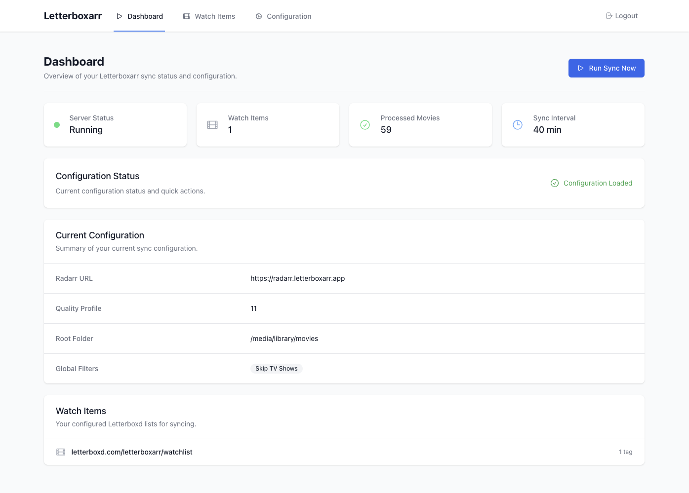

<div align="center">


# Letterboxarr

</div>

Automatically sync your Letterboxd lists to your Radarr instance. This script periodically checks your configured Letterboxd lists and adds any new movies to Radarr.



## Features

- 🎬 Scrapes multiple Letterboxd lists (watchlists, collections, actors, directors, etc.)
- 🏷️ Automatic tag assignment to movies based on their source list
- 🔄 Automatic periodic synchronization
- 📝 Tracks processed movies to avoid duplicates
- 🐳 Docker support for easy deployment
- 🔍 Smart movie matching using title and year, falling back to TMDB ID
- ⚡ Configurable sync interval and filters
- 🎭 Per-list filtering (skip documentaries, short films, etc.)
- ⚙️ YAML configuration file support
- 🌐 Web interface for configuration and monitoring

## Prerequisites

- A running Radarr instance
- Radarr API key
- Docker and Docker Compose (for containerized deployment)
- Python 3.11+ (for local deployment)
- Node.js 18+ (for frontend development)

## Setup

### 1. Get your Radarr API Key

1. Open Radarr web interface
2. Go to Settings → General → Security
3. Copy your API Key

### 2. Find your Quality Profile ID

Run this command to list available quality profiles:
```bash
curl -H "X-Api-Key: YOUR_API_KEY" http://your-radarr-url:7878/api/v3/qualityprofile
```

Note the `id` of your preferred quality profile.

### 3. Find your Root Folder Path

Run this command to list available root folders:
```bash
curl -H "X-Api-Key: YOUR_API_KEY" http://your-radarr-url:7878/api/v3/rootfolder
```

Note the `path` of your movies folder.

### 4. Create the configuration file

Copy the [example configuration file](examples/config.example.yml) to `config.yml` and customize it with your Radarr URL, API key, quality profile, root folder, and Letterboxd lists.

## Deployment Options

### Option 1: Docker Compose (Recommended)

Create a docker-compose.yml file:

```yaml
---
services:
  letterboxarr:
    image: fcote/letterboxarr:latest
    container_name: letterboxarr
    restart: unless-stopped
    ports:
      - "7373:7373"  # Web interface
    volumes:
      - ./config.yml:/app/config.yml  # Configuration file
      - ./data:/app/data              # Persistent storage for tracking processed movies
    environment:
      - SECRET_KEY=${SECRET_KEY:-your-secret-key-change-this-in-production}
      - ADMIN_USERNAME=${ADMIN_USERNAME:-admin}
      - ADMIN_PASSWORD=${ADMIN_PASSWORD:-admin}
```

Build and run:
```bash
docker-compose up -d
```

Access the web interface at `http://localhost:7373`

### Option 2: Docker Run

```bash
docker build -t letterboxarr .

docker run -d \
  --name letterboxarr \
  --restart unless-stopped \
  -p 7373:7373 \
  -v $(pwd)/config.yml:/app/config.yml \
  -v $(pwd)/data:/app/data \
  -e SECRET_KEY=your-secret-key-change-this \
  -e ADMIN_USERNAME=admin \
  -e ADMIN_PASSWORD=admin \
  letterboxarr
```

Then access the web interface at `http://localhost:7373`

### Option 3: Local Development

Install Python dependencies:
```bash
cd frontend && npm install && npm run build
pip install -r requirements.txt
```

Run the web server:
```bash
python main.py
```

### Supported Letterboxd List Types

- **User Lists**: `username/watchlist`, `username/films`, `username/diary`
- **Collections**: `films/in/collection-name`
- **Popular/Charts**: `films/popular`, `films/popular/this/year`
- **People**: `actor/name`, `director/name`, `writer/name`
- **Genres**: `films/genre/horror`, `films/genre/sci-fi`
- **Custom Lists**: Any valid Letterboxd URL path

### Tags and Filtering

Movies from each list can be automatically tagged in Radarr. Filters can be applied globally or per-list to skip certain types of content.

### Authentication

The web interface is protected by authentication. Default credentials:
- Username: `admin` (configurable via `ADMIN_USERNAME` environment variable)
- Password: `admin` (configurable via `ADMIN_PASSWORD` environment variable)

**Important**: Change these credentials in production by setting the environment variables.

## Data Persistence

The script maintains a `processed_movies.json` file to track which movies have been processed. This prevents duplicate additions and unnecessary API calls. This file is stored in the `/app/data` directory in the container (mapped to `./data` on the host).

## Contributing

Feel free to submit issues or pull requests for improvements!

## License

MIT License

## Disclaimer

This tool is not affiliated with Letterboxd or Radarr. Use responsibly and respect the terms of service of both platforms.